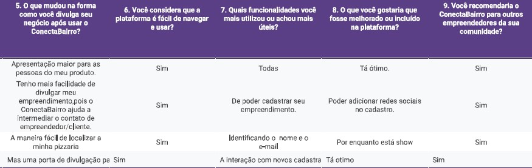

## 📑 Sumário

- [1. ConectaBairro](#1-conectabairro)
- [Conexão com a ODS 11](#conexão-com-a-ods-11)
- [2. Funcionalidades Implementadas](#2-funcionalidades-implementadas)
  - [Screenshots das telas principais](#screenshots-das-telas-principais)
  - [Desktop](#desktop)
  - [Mobile](#mobile)
- [3. Tecnologias Utilizadas](#3-tecnologias-utilizadas)
  - [Linguagens de Programação](#linguagens-de-programação)
  - [Frameworks e Bibliotecas](#frameworks-e-bibliotecas)
  - [Banco de Dados](#banco-de-dados)
  - [Ferramentas de Desenvolvimento](#ferramentas-de-desenvolvimento)
- [4. Arquitetura do Sistema](#4-arquitetura-do-sistema)
  - [Visão Geral da Arquitetura Implementada](#visão-geral-da-arquitetura-implementada)
  - [Componentes Principais](#componentes-principais)
  - [Integrações Realizadas](#integrações-realizadas)
- [5. Instruções de Instalação e Execução](#5-instruções-de-instalação-e-execução)
  - [Pré-requisitos](#pré-requisitos)
  - [Passo a Passo para Instalação](#passo-a-passo-para-instalação)
  - [Configurações Necessárias](#configurações-necessárias)
  - [Comandos para Execução](#comandos-para-execução)
- [6. Acesso ao sistema](#6-acesso-ao-sistema)
  - [URL de Acesso](#url-de-acesso)
  - [Credenciais de Teste](#credenciais-de-teste)
- [7. Validação com Público-Alvo](#7-validação-com-público-alvo)
  - [Definição específica do público-alvo](#definição-específica-do-público-alvo)
  - [Resumo do processo de validação](#resumo-do-processo-de-validação)
  - [Principais feedbacks recebidos](#principais-feedbacks-recebidos)
  - [Ajustes implementados](#ajustes-implementados)
  - [Resultados e aprendizados obtidos](#resultados-e-aprendizados-obtidos)
  - [Aprendizados principais](#aprendizados-principais)
- [8. Equipe de desenvolvimento](#8-equipe-de-desenvolvimento)

## 1. ConectaBairro
Muitas vezes nos deslocamos por grandes distâncias em busca de um serviço ou produto que precisamos. No entanto, na maioria das vezes, ali pertinho — ou mesmo um pouco mais longe, mas ainda dentro do mesmo bairro — há alguém que oferece exatamente aquilo que procuramos, seja um serviço ou um produto.

Pensando nisso, idealizamos o ConectaBairro, que tem como objetivo simplificar a forma como os moradores encontram serviços e empreendimentos locais. A proposta promove a economia colaborativa e ajuda pequenos empreendimentos — e até mesmo pequenos empreendedores — a conquistarem maior visibilidade junto aos moradores da região onde estão localizados.

A ideia é resgatar a função que, antigamente, era desempenhada pelos "jornaizinhos de bairro", agora em formato digital e com acesso via web. Empresas e empreendedores podem cadastrar seus empreendimentos para divulgar seus serviços e produtos, enquanto usuários comuns podem consultar opções próximas de forma fácil e eficiente — evitando substituições desnecessárias e fortalecendo a economia local.

## Conexão com a ODS 11 

O projeto ConectaBairro contribui diretamente para o Objetivo de Desenvolvimento Sustentável 11 — Cidades e Comunidades Sustentáveis — ao promover a valorização da economia local, facilitar o acesso a serviços e produtos no próprio bairro e incentivar a interação entre moradores e empreendedores. A plataforma fortalece a resiliência econômica das comunidades e estimula práticas de consumo mais conscientes e sustentáveis.

---

## 2. Funcionalidades Implementadas

| Funcionalidade                                                                 | Status da Implementação |
|-------------------------------------------------------------------------------|--------------------------|
| Cadastro e login de usuários                                                  | Completo                 |
| Cadastro de empreendimentos e serviços prestados                              | Completo                 |
| Listagem de empreendimentos por CEP, rua, bairro, cidade, estado ou palavras-chave | Completo             |
| Integração com API ViaCEP para autocompletar endereço                         | Completo                 |
| Integração com API OpenWeather para consulta do clima por cidade              | Completo                 |
| Operações CRUD para empreendimentos (criar, listar, editar, deletar)          | Completo                 |
| Rotas protegidas por JWT                                                      | Completo                 |
| Diferenciação de permissões (usuário comum vs usuário que cadastrou o empreendimento) | Completo    

### **Screenshots das telas principais**     

### **Desktop**

#### **Tela Inicial**

 

#### **Tela de Acesso ao Cadastro e Login**

 

#### **Formulário de Cadastro de Usuário**


#### **Tela de Login**


#### **Página de Usuário**


#### **Formulário de Cadastro de Empreendimentos**


#### **Menu "Meus Empreendimentos**


#### **Tela de Busca de Empreendimentos**


---

### **Mobile**

#### **Tela Inicial**


#### **Tela de Acesso ao Cadastro e Login**


#### **Formulário de Cadastro de Usuário**


#### **Tela de Login**


#### **Página de Usuário**


#### **Formulário de Cadastro de Empreendimentos**


#### **Menu "Meus Empreendimentos**


#### **Tela de Busca de Empreendimentos**


---

## 3. Tecnologias Utilizadas

### Linguagens de Programação
- [JavaScript](https://developer.mozilla.org/pt-BR/docs/Web/JavaScript) — utilizado tanto no front-end quanto no back-end

### Frameworks e Bibliotecas
- [Node.js](https://nodejs.org/) + [Express](https://expressjs.com/) — back-end
- [Mongoose](https://mongoosejs.com/) — modelagem de dados com MongoDB
- [JWT (JSON Web Token)](https://jwt.io/) — autenticação
- [bcryptjs](https://github.com/dcodeIO/bcrypt.js) — hash de senhas
- [Fetch API](https://developer.mozilla.org/pt-BR/docs/Web/API/Fetch_API) — consumo de APIs externas (ViaCEP, OpenWeather)
- [Jest](https://jestjs.io/) + [Supertest](https://github.com/visionmedia/supertest) — testes automatizados

### Banco de Dados
- [MongoDB](https://www.mongodb.com/) — armazenamento dos dados
- [MongoMemoryServer](https://github.com/nodkz/mongodb-memory-server) — simulação de banco para testes

### Ferramentas de Desenvolvimento
- [Nodemon](https://nodemon.io/) — atualização automática durante o desenvolvimento
- [Visual Studio Code](https://code.visualstudio.com/) — ambiente de codificação
- [Git](https://git-scm.com/) + [GitHub](https://github.com/) — controle de versão e colaboração
- [Vercel](https://vercel.com/) — deploy da aplicação
---

## 4. Arquitetura do Sistema

### Visão Geral da Arquitetura Implementada

O sistema ConectaBairro foi desenvolvido com base em uma arquitetura modular, dividida em três camadas principais: frontend, backend e banco de dados, além de integrações externas com APIs públicas. A estrutura foi pensada para garantir escalabilidade, organização e facilidade de manutenção. O backend segue o padrão MVC adaptado para uma API RESTful, enquanto o frontend foi desenvolvido com foco em simplicidade e acessibilidade para o público-alvo.

### Componentes Principais

A estrutura de diretórios do projeto está organizada conforme o modelo abaixo:

```
ConectaBairro/
├── backend/                         # Backend do projeto (API em Node.js/Express)
│   ├── src/                         # Código-fonte da aplicação
│   │   ├── config/                  # Configurações globais da aplicação
│   │   │   └── db.js                # Conexão com o banco de dados MongoDB via Mongoose
│   │   ├── controllers/             # Handlers das rotas (lógica de requisição/resposta)
│   │   ├── models/                  # Schemas e modelos Mongoose (MongoDB)
│   │   ├── routes/                  # Definição das rotas da API (Express)
│   │   ├── services/                # Serviços e integrações externas (ex.: ViaCEP, clima)
│   │   └── middlewares/             # Middlewares (autenticação, validação, logs)
│   │   └── utils/                   # Funções utilitárias reutilizáveis (ex.: filtros, normalizações)
│   ├── testes/                      # Testes e configuração do ambiente de testes
│   │   ├── endpoints.test.js        # Especificações de testes dos endpoints da API
│   │   ├── jest.config.js           # Configuração do Jest
│   │   └── setupTestDB.js           # Bootstrap do banco de testes (Mongo em memória)
│   ├── .env                         # Variáveis de ambiente (local; não versionado)
│   └── package.json                 # Dependências e scripts do backend
│
├── frontend/                        # Recursos estáticos do frontend
│   ├── CSS/                         # Arquivos de estilo (CSS)
│   ├── HTML/                        # Páginas HTML
│   ├── IMG/                         # Imagens
│   └── JS/                          # Scripts JavaScript do cliente
│
├── database/                        # Documentação e exemplos do modelo de dados
│   ├── database.md                  # Documentação da estrutura de dados (MongoDB)
│   ├── empreendimentos.json         # Exemplo de documentos da coleção Empreendimentos
│   └── usuarios.json                # Exemplo de documentos da coleção Usuários
│
├── docs/                            # Documentação técnica do projeto
│   ├── api/                         # Referência da API
│   │   └── api_documentation.md
│   ├── architecture/                # Arquitetura do sistema
│   │   ├── architecture.md
│   │   └── diagrama_arquitetura_api (1).png
│   └── requeriments/                # Requisitos e especificações
│       └── api_documentation.md
│
├── validation/                      # Evidências de validação e feedback dos usuários
│   ├── evidence/                    # Evidências (entrevistas, autorizações, screenshots)
│   │   ├── autorization/            # Termos de consentimento/autorizações
│   │   └── screenshot_telas/        # Capturas de tela da plataforma
│   └── feedback/                    # Materiais de feedback
│       └── videos/                  # Vídeos e anexos relacionados ao feedback
│           ├── recorte-respostas-formulario-de-feedback.jpg
│           ├── Respostas-Forms-Validacao-Feedback-Publico-Alvo.pdf
│   ├── target_audience.md           # Relatório detalhado da validação
│   └── validation_report.md         # Definição específica do público-alvo
│
├── env.example                      # Exemplo de arquivo de variáveis de ambiente (raiz)
├── vercel.json                      # Configuração de deploy (Vercel)
├── .gitignore                       # Regras de arquivos ignorados pelo Git
└── README.md                        # Documentação principal do projeto

```

### Integrações Realizadas
O sistema conta com as seguintes integrações externas:

- [ViaCEP](https://viacep.com.br/) — utilizada para autocompletar os dados de endereço com base no CEP informado pelo usuário.

- [OpenWeatherMap](https://openweathermap.org/api) — integrada para exibir informações climáticas da cidade do empreendimento.

- [MongoDB Atlas](https://www.mongodb.com/cloud/atlas) — banco de dados NoSQL utilizado para armazenar os dados dos usuários e empreendimentos.

- [JWT (JSON Web Token)](https://jwt.io/) — utilizado para autenticação e proteção de rotas sensíveis.

- [MongoMemoryServer](https://github.com/nodkz/mongodb-memory-server) — utilizado nos testes automatizados para simular o banco de dados em memória.

- [Jest](https://jestjs.io/) + [Supertest](https://github.com/visionmedia/supertest) — ferramentas utilizadas para testar endpoints da API e garantir a estabilidade do sistema.

---

## 5. Instruções de Instalação e Execução

### **Pré-requisitos**

Antes de iniciar, certifique-se de ter os seguintes itens instalados em sua máquina:

- [Node.js](https://nodejs.org/) — versão 18 ou superior recomendada  
- [Visual Studio Code](https://code.visualstudio.com/) — editor de código recomendado  
- [Git](https://git-scm.com/) — para clonar o repositório

### **Passo a Passo para Instalação**

### Clone o repositório

```bash
git clone https://github.com/Elaynenl/ConectaBairro.git
cd ConectaBairro/backend 
```
### Instale as dependências

```
npm install
```
### Configure as variáveis de ambiente 

Crie um arquivo .env na raiz do projeto com base no arquivo .env.example já incluído no repositório. 

```bash
cp .env.example .env
```

### **Configurações Necessárias**

Preencha o arquivo .env com os valores reais conforme seu ambiente:

```
PORT=3000
MONGO_URI=coloque_sua_string_de_conexao_do_mongodb_atlas
JWT_SECRET=sua_chave_secreta_para_token
OPENWEATHER_API_KEY=sua_chave_da_api_openweather

``` 
💡 Dica: você pode obter a chave da OpenWeather em https://openweathermap.org/api

### Execute o servidor em modo desenvolvimento

```
npm run dev
```
Obs: O servidor será iniciado em http://localhost:3000


### **Comandos para Execução**

| Script         | Descrição                                                                 |
|----------------|---------------------------------------------------------------------------|
| `npm run dev`  | Inicia o servidor com **nodemon**                                         |
| `npm start`    | Inicia o servidor com **Node.js padrão**                                  |
| `npm test`     | Executa os testes automatizados com **Jest** e **Supertest** usando banco em memória |

---

## 6. Acesso ao sistema

### URL de Acesso

O sistema ConectaBairro está hospedado e pode ser acessado pelo seguinte endereço:

https://conectabairro.vercel.app 

### Credenciais de Teste

Para fins de validação e demonstração, utilize as credenciais abaixo:

```plaintext
Usuário: teste@conectabairro.com  
Senha: conectabairro123
```

## 7. Validação com Público-Alvo

### **Definição específica do público-alvo**

O público-alvo do sistema ConectaBairro são empreendedores e microempresários dos bairros Pio XII e São João do Tauape, localizados em Fortaleza–CE. A proposta do sistema é facilitar a visibilidade e o acesso aos empreendimentos locais, promovendo inclusão digital e fortalecimento da economia comunitária.

Durante a fase de validação, foram entrevistados 17 empreendedores da região, com foco em entender suas necessidades reais. Dentre eles, 4 empreendimentos foram selecionados para um acompanhamento mais próximo:

**Casa da Limpeza** <br> Produtos de limpeza em geral <br> 📍 Rua Ana Gonçalves, 456 – Tauape – CEP: 60130-490

  
 

**Mm's Açaí** <br>
 Açaí e gelatos artesanais <br>
 📍 Rua José Justa, 4165 – Tauape – CEP: 60120-290

   


**PAPA BURGUER / PAPA PIZZA** <br> Pizzas, pastéis e sanduíches com atendimento local e delivery <br> 📍 Rua Carvalho Júnior, 403 – Tauape – CEP: 60130-460

  

**RB Depósito de Água** <br>
  Ponto de venda de água mineral <br>
 📍 Rua Capitão Melo, 4250 - Tauape, - CEP: 60120095

  

### **Resumo do processo de validação**

Após a construção da aplicação, os empreendedores selecionados participaram de uma apresentação presencial conduzida por Aluísio Rodrigues, integrante da equipe de desenvolvimento. Durante esse encontro, foram realizados registros em fotos e vídeos para documentar a interação com o sistema.

Em seguida, os participantes responderam a um formulário de feedback via Google Forms, com o objetivo de avaliar a usabilidade, clareza das funcionalidades e relevância da proposta.

### **Principais feedbacks recebidos**

Os empreendedores demonstraram alta receptividade à proposta do ConectaBairro:

**Recorte de algumas respostas do formulário de feedback:**


<br><br>

- [**Formulário Aplicado aos empreendedores participantes**](https://forms.gle/9kZtQHvKhxZtTVka6)

- [**Acessar respostas da validação**](validation/feedback/Respostas-Forms-Validacao-Feedback-Publico-Alvo.pdf)


### **Ajustes implementados**

Após a coleta dos feedbacks por meio de formulário no Google Forms, verificamos que um dos participantes da ação, sugeriu que fosse implementado um campo no formulário de cadastro dos empreendimentos que possibilitasse a inclusão das redes sociais do estabelecimento.

Com a funcionalidade implementada o formulário de cadastro dos empreendimentos ficou assim:

**Desktop**


**Mobile**


### **Resultados e aprendizados obtidos**

**Participação:** Foram coletadas respostas de diferentes empreendedores locais, incluindo pizzarias, pequenos negócios e prestadores de serviços.

**Cadastro e uso inicial:** Todos os participantes conseguiram cadastrar seus empreendimentos na plataforma sem dificuldades.

**Visibilidade do negócio:**

- Alguns relataram aumento inicial na divulgação de seus produtos/serviços.

- Outros ainda não perceberam impacto significativo, mas reconhecem potencial.

**Novos contatos/clientes:**

- Parte dos empreendedores já recebeu contatos por meio da plataforma.

- Outros ainda não tiveram retorno, mas acreditam que isso ocorrerá com maior uso.

**Conexão com outros empreendedores:**

- Alguns já conseguiram se conectar com vizinhos e empreendedores do bairro.

- Outros ainda não exploraram essa funcionalidade.

**Mudanças na divulgação:**

- Maior facilidade em apresentar produtos e serviços.

- Reconhecimento de que a plataforma abre novas portas de divulgação.

**Facilidade de navegação:** Todos os respondentes consideraram a plataforma fácil de usar.

**Funcionalidades mais úteis:**

- Cadastro de empreendimentos.

- Identificação rápida de nome e e‑mail.

- Interação com novos cadastros.

**Sugestões de melhoria:**

- Possibilidade de adicionar redes sociais no cadastro.

- Mais opções de filtros e interação.

- Alguns consideraram que “já está ótimo” no estágio atual.

**Recomendação:** Todos afirmaram que recomendariam o ConectaBairro para outros empreendedores da comunidade.

**Impacto inicial:**

- Alguns perceberam mudanças positivas na rotina.

- Outros ainda estão explorando ou captando clientes, mas reconhecem o potencial.

**LGPD:** Todos autorizaram o uso das informações para fins de melhoria da plataforma.

### **Aprendizados principais**
- A plataforma já é percebida como fácil de usar e útil para divulgação.

- Existe demanda por integração com redes sociais e novos filtros de busca.

- O impacto inicial varia conforme o tipo de negócio, mas há consenso sobre o potencial de crescimento.

- A recomendação espontânea mostra que o projeto tem aceitação positiva entre os empreendedores locais.

## 8. Equipe de desenvolvimento

O sistema ConectaBairro foi desenvolvido por uma equipe composta por seis integrantes, com atuação colaborativa e responsabilidades bem definidas. A divisão de tarefas foi planejada desde o início e executada com clareza, garantindo rastreabilidade dos commits e organização do repositório.

**Elayne Nascimento Lima** <br>
Função: Líder Técnica e Desenvolvedora Principal <br>

**Contribuições:**

 - Planejamento da arquitetura da API e definição da estrutura de pastas

 - Implementação completa das rotas de empreendimentos (controller, model, validações)

 - Criação do middleware de autenticação com JWT

 - Desenvolvimento do serviço de integração com a API ViaCEP

 - Elaboração do arquivo .env.example com variáveis de ambiente

 - Redação dos aquivos README.md, validation_report.md, target_audience.m  e organização da documentação geral do projeto nas pastas obrigatórias.

 - Apoio na estruturação inicial do frontend

**Arquivos sob responsabilidade:**

 - src/controllers/empreendimentosController.js

 - src/models/Empreendimento.js

 - src/routes/empreendimentosRoutes.js

 - src/services/viaCepService.js

 - src/middleware/authMiddleware.js

 - .env.example

 - README.md

**Gilssilany Valentino Chaves**<br>
Função: Autenticação e Segurança<br>

**Contribuições:**

 - Implementação do controller de usuários (cadastro e login)

 - Configuração da conexão com o banco de dados MongoDB Atlas

 - Validação de tokens JWT e testes de rotas protegidas

 - Apoio na criação da página de login no frontend

 - Arquivos sob responsabilidade:

 - src/controllers/usuariosController.js

 - src/config/db.js

**Igor Marcelo de Sousa Freire**<br>
Função: Integração com Serviços Externos<br>

**Contribuições:**

 - Implementação dos controllers de clima e CEP com consumo das APIs OpenWeatherMap e ViaCEP

 - Criação e manutenção dos serviços de integração com APIs públicas

 - Organização das rotas externas de clima e CEP

 - Apoio na exibição de dados climáticos no frontend

 - Arquivos sob responsabilidade:

 - src/controllers/climaController.js

 - src/controllers/cepController.js

 - src/services/climaService.js

 - src/routes/climaRoutes.js

 - src/routes/cepRoutes.js

**Francisco Eudes Rodrigues da Silva**<br>
Função: Documentação Técnica e Estrutura de Rotas<br>

**Contribuições:**

 - Redação da documentação técnica da arquitetura da API

 - Organização da estrutura de rotas de usuários

 - Apoio na definição dos fluxos de autenticação e cadastro

 - Participação na estruturação das páginas de cadastro e navegação no frontend

 - Arquivos sob responsabilidade:

 - docs/architecture.md

 - src/routes/usuariosRoutes.js

**Marcus Vinícius Monteiro da Silva Costa**<br>
Função: Modelagem de Dados e Validações<br>

**Contribuições:**

 - Definição dos campos e regras de validação do modelo de usuário

 - Estruturação do schema com criptografia de senha

 - Sugestões de tratamento de erros e mensagens de validação

 - Apoio na validação de formulários no frontend com JavaScript

 - Arquivo sob responsabilidade:

 - src/models/Usuario.js

**Aluísio Rodrigues Júnior**<br>
Função: Testes e Validação Técnica<br>

**Contribuições:**

 - Testes manuais das rotas públicas e protegidas

 - Validação das respostas da API e sugestões de melhoria na experiência de uso

 - Estruturação e desenvolvimento dos testes automatizados com Jest e Supertest

 - Participação na apresentação da aplicação aos empreendedores locais

Arquivos sob responsabilidade:

 - test/endpoints.test.js

 - setupTestDB.js

 - jest.config.js

--- 