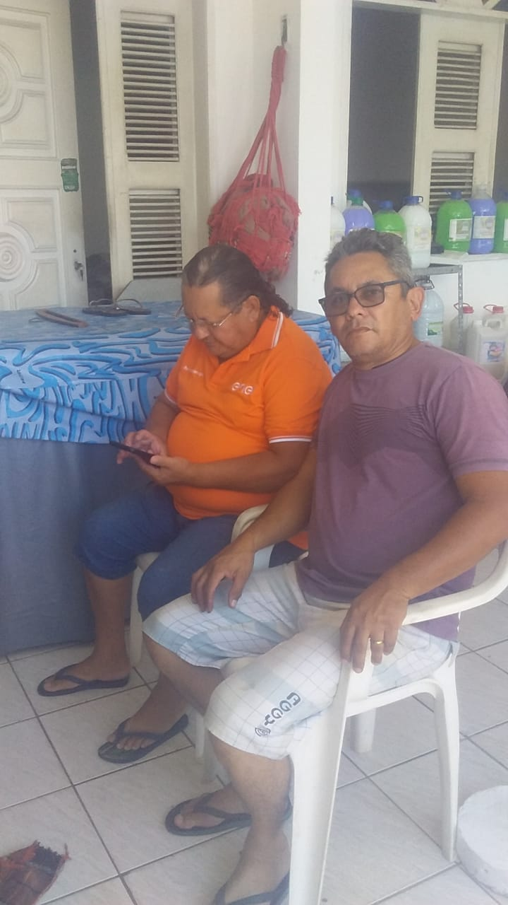
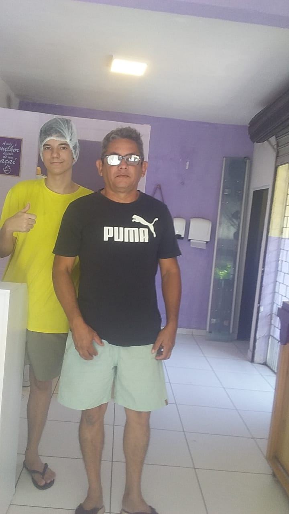
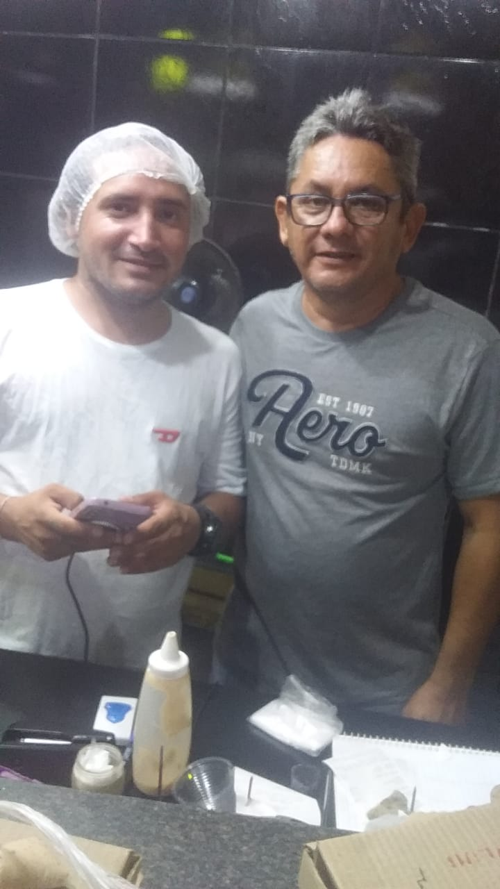
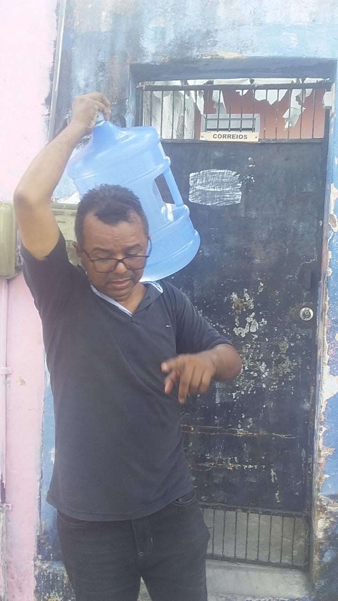
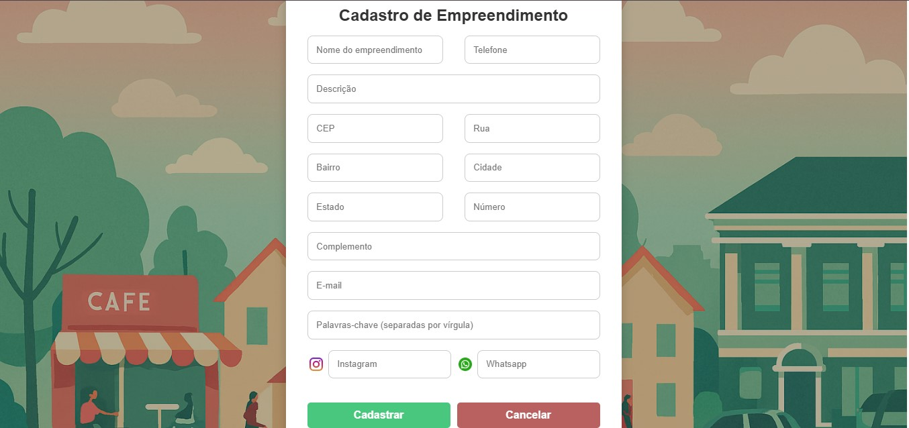
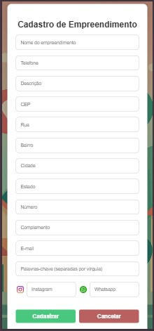

# Relatório de Validação com o Público-Alvo

## Objetivo da Validação

Validar a proposta do sistema ConectaBairro junto ao público-alvo definido, verificando a clareza das funcionalidades, a usabilidade da plataforma e a relevância da solução para o contexto dos empreendedores locais.

---

## Metodologia

A validação foi conduzida em duas etapas:

1. **Apresentação presencial da plataforma**  
   Realizada por Aluísio Rodrigues, integrante da equipe de desenvolvimento, com demonstração prática das funcionalidades. O encontro foi documentado com registros em fotos e vídeos.

2. **Formulário de feedback via Google Forms**  
   Aplicado aos participantes para coleta de opiniões sobre usabilidade, clareza, utilidade e sugestões de melhoria.

---

## Participantes

- Total de empreendedores entrevistados: **17**
- Empreendimentos acompanhados de forma aprofundada: **4**
  - Casa da Limpeza
  - Mm's Açaí
  - PAPA BURGUER
  - RB Depósito de Água

---

## Evidências da Validação com o Público-Alvo

### Casa da Limpeza

### Feedback enviado pelo Sr Edson após validação da plataforma:

<video width="640" height="360" controls>
  <source src="./feedback/videos/Feedback-Sr-Edson-Casa-da-Limpeza_.mp4" type="video/mp4">  
</video>

[Clique para assistir o feedback no YouTube](https://youtu.be/QZuuTd0Rm_w)

---

### Mm's Açaí

A validação da plataforma foi realizada com o Sr. Miguel, Sócio e Proprietário da Mm's Açaí

 

### **Feedback enviado pelo Sr Miguel após a validação da plataforma**

<video width="640" height="360" controls>
  <source src="./feedback/videos/Feedback-Sr-Miguel-Mms-Açai.mp4" type="video/mp4">  
</video>

[Clique para assistir ao feedback no Youtube](https://youtube.com/shorts/u9TkUAvUAv8?feature=share)

---

### PAPA BURGUER

A validação da plataforma foi realizada em duas ocasiões, uma com um dos sócios e proprietários Sr. Douglas e em outra com a Sra Geane, esposa do Proprietário Sr. Douglas, pois o mesmo estava viajando.

### **Feedback enviado pela Sra Jeane após a validação da plataforma**

<video width="640" height="360" controls>
  <source src="./feedback/videos/Feedback-Sra-Geane-Esposa-Sr-Douglas-Papa-Burguer.mp4" type="video/mp4">  
</video>

[Clique para assistir ao feedback no Youtube](https://youtube.com/shorts/gLxMGPPwrRo?feature=share)

### RB Depósito de Água

A validação da plataforma foi realizada com o Sr. Roberto, proprietário da empresa.

### **Feedback enviado pelo Sr Roberto após a validação da plataforma**

<video width="640" height="360" controls>
  <source src="./feedback/videos/Feedback-Sr-Roberto-RB-Deposito-de-Agua.mp4" type="video/mp4">  
</video>

[Clique para assistir ao feedback no Youtube](https://youtube.com/shorts/mzJoQKOaaqs?feature=share)

### Principais feedbacks recebidos

Os empreendedores demonstraram alta receptividade à proposta do ConectaBairro:

**Recorte de algumas respostas do formulário de feedback:**

  

- [**Formulário Aplicado aos empreendedores participantes**](https://forms.gle/9kZtQHvKhxZtTVka6)

- [**Acessar respostas da validação**](./feedback/Respostas-Forms-Validacao-Feedback-Publico-Alvo.pdf)

### Ajustes implementados

Após a coleta dos feedbacks por meio de formulário no Google Forms, verificamos que um dos participantes da ação, sugeriu que fosse implementado um campo no formulário de cadastro dos empreendimentos que possibilitasse a inclusão das redes sociais do estabelecimento.

Com a funcionalidade implementada o formulário de cadastro dos empreendimentos ficou assim:

**Desktop**

**Mobile**

### **Resultados e aprendizados obtidos**

**Participação:** Foram coletadas respostas de diferentes empreendedores locais, incluindo pizzarias, pequenos negócios e prestadores de serviços.

**Cadastro e uso inicial:** Todos os participantes conseguiram cadastrar seus empreendimentos na plataforma sem dificuldades.

**Visibilidade do negócio:**

- Alguns relataram aumento inicial na divulgação de seus produtos/serviços.

- Outros ainda não perceberam impacto significativo, mas reconhecem potencial.

**Novos contatos/clientes:**

- Parte dos empreendedores já recebeu contatos por meio da plataforma.

- Outros ainda não tiveram retorno, mas acreditam que isso ocorrerá com maior uso.

**Conexão com outros empreendedores:**

- Alguns já conseguiram se conectar com vizinhos e empreendedores do bairro.

- Outros ainda não exploraram essa funcionalidade.

**Mudanças na divulgação:**

- Maior facilidade em apresentar produtos e serviços.

- Reconhecimento de que a plataforma abre novas portas de divulgação.

**Facilidade de navegação:** Todos os respondentes consideraram a plataforma fácil de usar.

**Funcionalidades mais úteis:**

- Cadastro de empreendimentos.

- Identificação rápida de nome e e‑mail.

- Interação com novos cadastros.

**Sugestões de melhoria:**

- Possibilidade de adicionar redes sociais no cadastro.

- Mais opções de filtros e interação.

- Alguns consideraram que “já está ótimo” no estágio atual.

**Recomendação:** Todos afirmaram que recomendariam o ConectaBairro para outros empreendedores da comunidade.

**Impacto inicial:**

- Alguns perceberam mudanças positivas na rotina.

- Outros ainda estão explorando ou captando clientes, mas reconhecem o potencial.

**LGPD:** Todos autorizaram o uso das informações para fins de melhoria da plataforma.

### **Aprendizados principais**
- A plataforma já é percebida como fácil de usar e útil para divulgação.

- Existe demanda por integração com redes sociais e novos filtros de busca.

- O impacto inicial varia conforme o tipo de negócio, mas há consenso sobre o potencial de crescimento.

- A recomendação espontânea mostra que o projeto tem aceitação positiva entre os empreendedores locais.

## Conclusão

A validação confirmou que o sistema ConectaBairro atende às necessidades reais dos empreendedores locais, com potencial para gerar impacto positivo na economia comunitária. A receptividade dos participantes reforça a viabilidade da plataforma e orienta futuras melhorias com base em demandas concretas.
